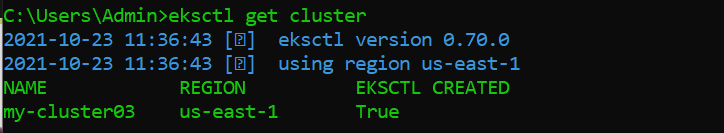
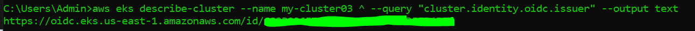
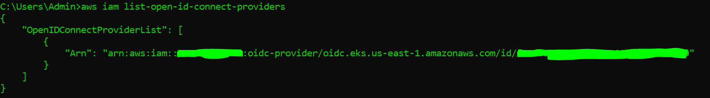
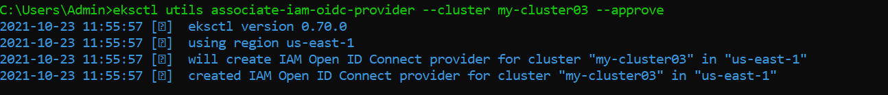
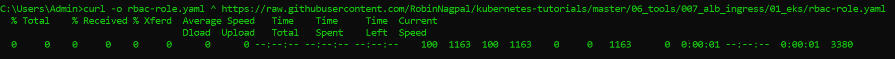
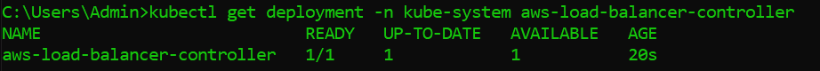
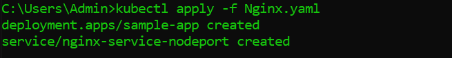
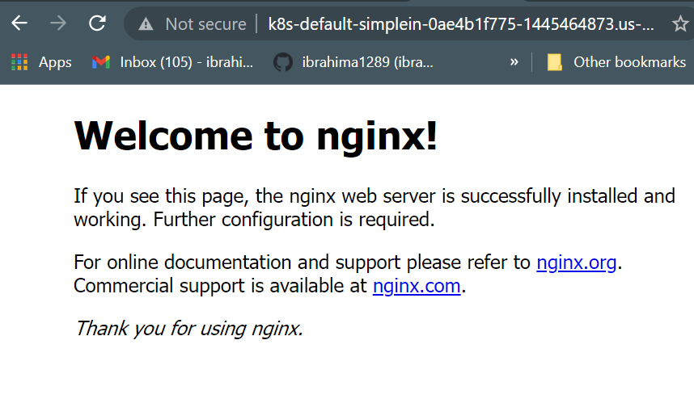

<h1 align=center>EKS assignment</h1>   

## Requirements:
- [Screenshot](https://github.com/ibrahima1289/EKS_ASGMT/blob/main/images/EKS-Assign9.PNG) of completed assignment.
- Topology of what was builded.
- **EXTRA!!!** Now deploy your own Python application with a load balancer.

👉Link to assignment instructions: [here](https://github.com/kura-labs-org/EKS_ASGMT/blob/main/EKS%20assignment.pdf)  

## Precedure:

The commands are for **Windows users**. If you are using **Mac** or **Linux** environment, replace the `^` by a `\`.

### Task 1: 

1. Create your cluster.

```
> kubectl cluster create {cluster_name}
```

Verification: 



2. Create a Ngnix deployment yaml file with a service. In this case, the file is named [Nginx.yaml](https://github.com/ibrahima1289/EKS_ASGMT/blob/main/Nginx.yaml).

3. Create another yaml file for the ingress controller named [Nginx-Ingress.yaml](https://github.com/ibrahima1289/EKS_ASGMT/blob/main/Nginx-Ingress.yaml)

### Task 2

1. Enter the command below to see the cluster ID.

```
> aws eks describe-cluster --name {cluster_name} ^ 
--query "cluster.identity.oidc.issuer" --output text
```




2. Enter the command below to see the OpenID connect.

```
> aws iam list-open-id-connect-providers
```


3. Add an OpenID connect to the cluster.

```
> eksctl utils associate-iam-oidc-provider --cluster {cluster_name} --approve
```


### Task 3

1. Download the role base Access Control.

```
> curl -o rbac-role.yaml ^ 
https://raw.githubusercontent.com/RobinNagpal/kubernetes-tutorials/master/06_tools/007_alb_ingress/01_eks/rbac-role.yaml 
```


2. Apply the downloaded file by using the command below.

```
> kubectl apply -f rbac-role.yaml
```

3. Download the iam policy

```
> curl -o iam_policy.json ^
https://raw.githubusercontent.com/kubernetes-sigs/aws-load-balancer-controller/v2.3.0/docs/install/iam_policy.json
```

4. Create the AWS policy 

```
> aws iam create-policy ^
--policy-name AWSLoadBalancerControllerIAMPolicy ^
--policy-document file://iam_policy.json
```

5. Create the service account: 

```
> eksctl create iamserviceaccount ^
--cluster=my-cluster03 ^
--namespace=kube-system ^
--name=aws-load-balancer-controller ^
--attach-policy-arn=arn:aws:iam::{your_aws_account_ID}:policy/AWSLoadBalancerControllerIAMPolicy ^
--override-existing-serviceaccounts ^
--approve
``` 
	
6.  Create certificate manager for the ingress controller:

```
> kubectl apply ^
--validate=false ^
-f https://github.com/jetstack/cert-manager/releases/download/v1.5.4/cert-manager.yaml
```

### Task 4

1. Make the load balancer controller by downloading and running the following commands:

```
> curl -o v2_3_0_full.yaml ^
https://github.com/kubernetes-sigs/aws-load-balancer-controller/releases/download/v2.3.0/v2_3_0_full.yaml
```

2. Edit the file that was downloaded `v2_3_0_full.yaml`.<br> 
(replace {cluster-name=your-cluster-name} with your cluster name )

3. Now, enter the following command below to run the `yaml` file:

```
> kubectl apply -f v2_3_0_full.yaml
```


4. Use this command to view the controller: 

```
> kubectl get deployment -n kube-system aws-load-balancer-controller
```



### Task 5 : 

1. Create your application in EKS by creating the deployment and service yaml file. Also the ingress yaml file. 

	* For the **Nginx** App, run:
	```
  	> kubectl apply -f Nginx.yaml
	```
	
	
	* For the **Service**, run:
	```
	> kubectl apply -f Nginx-Ingress.yaml
	```

2. Test out your application by checking the ALB url.



3. Clean up, run:
```
kubectl delete all --all
```

Make sure the clusters, VPCs, Load Balancers, EC2s, etc. are deleted on **AWS*.

	

## Sources:

1. https://kubernetes.io/docs/concepts/services-networking/ingress/
2. https://aws.amazon.com/blogs/opensource/kubernetes-ingress-aws-alb-ingress-controller/


